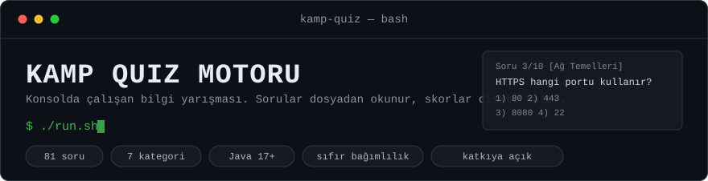
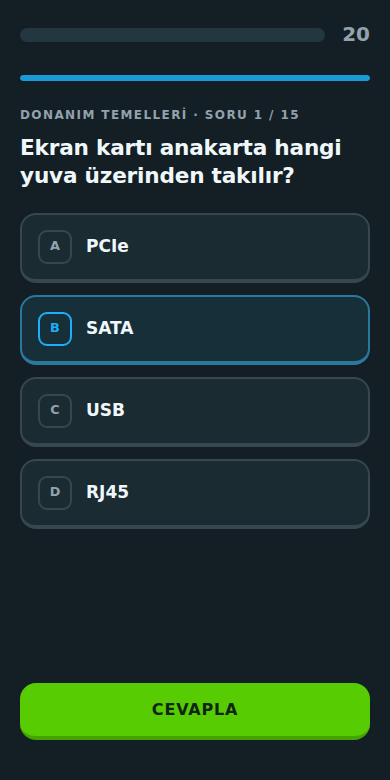
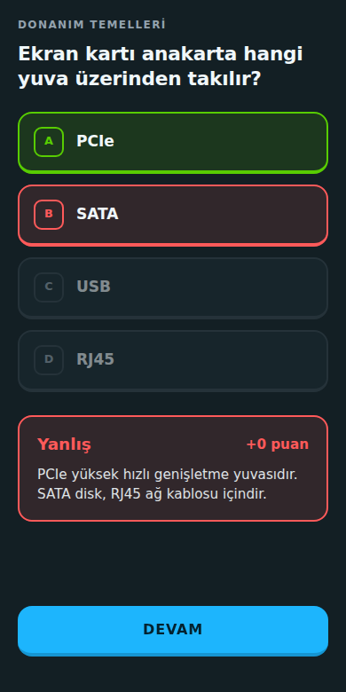
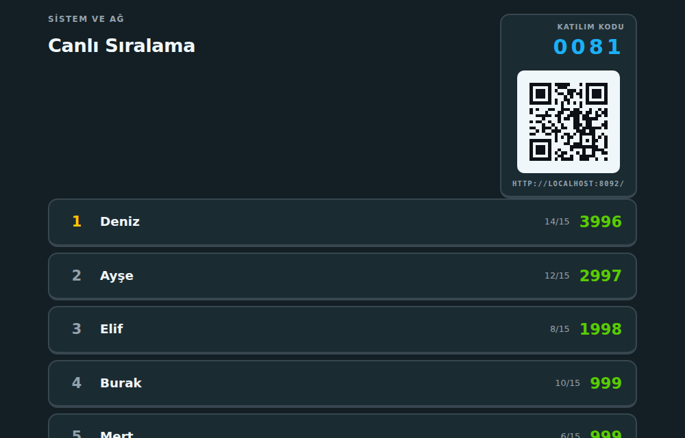
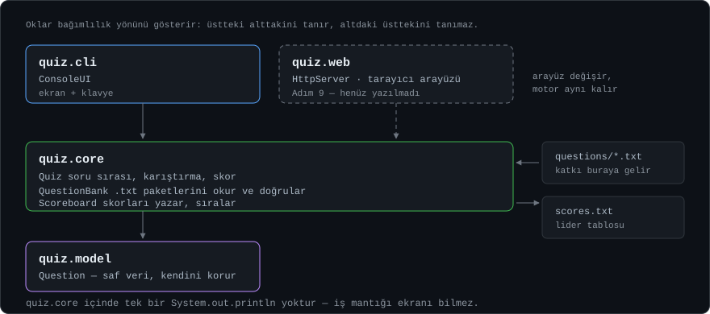

**Sınıfça oynanan bilgi yarışması.** Hoca laptopunda sunucuyu başlatır, öğrenciler
kendi telefonlarından bir QR kod okutup katılır, cevaplar geldikçe projeksiyondaki
sıralama canlı döner.

Kahoot ya da Wayground'un yaptığı işi yapar — ama **internete, hesaba ve tek bir
dış kütüphaneye ihtiyaç duymadan**, sadece aynı Wi-Fi üzerinden. Java ile sıfırdan
yazıldı; tek gereksinimi Java 17.

| Soru | Cevap | Projeksiyon |
|---|---|---|
|  |  |  |

---

## 2 dakikada dene

```bash
git clone https://github.com/efea0/kamp-quiz.git
cd kamp-quiz
./run.sh              # Windows: run.bat
```

Terminalde tek kişilik oynarsın. Sınıfça oynamak için:

```bash
./run.sh web          # Windows: run.bat web
```

Sunucu açılışta bağlantı adresini yazar:

```
=========================================
  SUNUCU ÇALIŞIYOR
=========================================
  Bu bilgisayarda : http://localhost:8080
  Aynı Wi-Fi'dan  : http://192.168.1.42:8080
=========================================
```

## Sınıfça oynamak — 3 adım

1. **Oda kur:** `http://<adres>:8080/kur` → bir test seç → 4 haneli kod üretilir
2. **Projeksiyona aç:** `/ekran?kod=1234` → canlı sıralama 3 saniyede bir yenilenir
3. **Katıl:** öğrenciler ana sayfadan kodu yazar, ya da ekrandaki **QR kodu okutur**

Herkes aynı testten sorulur ama **soru seçimi ve sırası kişiye özeldir** — yan yana
oturanlar birbirinin ekranından kopyalayamaz.

Test bitince `/rapor?kod=1234` en çok yanlış yapılan soruları sıralar:
hangi konuyu tekrar anlatmak gerektiği doğrudan görünür.

## Neler var

| | |
|---|---|
| **81 soru, 7 kategori** | Ağ, Linux, donanım, özgür yazılım, Java, genel kültür, matematik |
| **6 hazır test** | 10 / 15 / 20 soruluk, süresi ayarlı paketler |
| **Hız puanı** | Doğru cevap 500 puan, kalan süreye göre +500'e kadar bonus |
| **Açıklamalar** | Cevaptan sonra "neden bu cevap" gösterilir — 67 soruda mevcut |
| **Tekrar modu** | Sadece yanlışlarından oluşan ikinci bir tur |
| **Yanlış raporu** | Hocaya, hangi sorunun kaç kişiyi düşürdüğü |
| **QR kod** | Java'da sıfırdan üretiliyor, dış servis yok |
| **AI ile soru üretme** | Konu yaz, paket üretsin; düzenle, sonra kaydet |
| **İki arayüz** | Terminal ve tarayıcı, aynı motoru kullanır |

## Soru eklemek — katkının en kolay yolu

Java bilmene gerek yok. `questions/` klasörüne bir `.txt` dosyası ekle:

```
# baslik: Tarih

İstanbul hangi yıl fethedildi? | 1453 | 1071 | 1299 | 1923 | 1
> Fatih Sultan Mehmet döneminde, 29 Mayıs 1453'te fethedildi.
```

Kurallar: ayırıcı `|`, son sütun doğru şıkkın numarası (**1'den** başlar),
`>` satırı o sorunun açıklamasıdır (isteğe bağlı ama çok değerli).

```bash
git checkout -b soru/tarih-paketi
# dosyayı ekle
./run.sh test          # bozmadığından emin ol
./run.sh               # kendi sorularını gör
git commit -am "Tarih soru paketi eklendi"
git push -u origin soru/tarih-paketi
```

Ayrıntılar: **[CONTRIBUTING.md](CONTRIBUTING.md)**

## Test

```bash
./run.sh test
```

Dış test kütüphanesi yok; `src/quiz/test/SelfTest.java` soruları, puanlamayı,
kapsüllemeyi ve hazır testleri denetler. Değişikliğini göndermeden önce çalıştır.

## Proje yapısı



```
src/quiz/
├── QuizApp.java            giriş noktası, parçaları bağlar
├── model/Question.java     soru verisi, kendi geçerliliğini korur
├── core/                   iş mantığı — ekranı hiç bilmez
│   ├── QuestionBank.java   questions/*.txt okur, bozuk satırı atlar
│   ├── Quiz.java           sıra, süre, puan, cevap geçmişi
│   ├── QuizSet.java        hazır test tanımı
│   └── Scoreboard.java     scores.txt'ye yazar, sıralar
├── cli/ConsoleUI.java      terminal arayüzü
├── web/                    tarayıcı arayüzü
│   ├── WebServer.java      JDK'nın HttpServer'ı, oturumlar, odalar
│   ├── QrCode.java         sıfırdan QR kodlayıcı
│   └── Html.java           sayfa şablonu ve stil
├── ai/QuestionGenerator.java   Gemini / OpenRouter ile soru üretimi
└── test/SelfTest.java      kendi kendini sınama

questions/   soru paketleri  ← katkı buraya
sets/        hazır test tanımları
```

**Değişmez kural:** `core/` ve `model/` paketlerinde tek
bir `System.out.println` yoktur — ekranı hiç tanımazlar. Bozuk bir soru satırı
bulunduğunda uyarı ekrana basılmaz, çağıran arayüze **liste olarak döndürülür**;
onu nasıl göstereceğine terminal ya da web arayüzü karar verir.

Bu kural yazıyla kalmıyor: `./run.sh test` kaynak kodu okuyup `core` ve `model`
paketlerinde `System.out` geçip geçmediğini denetliyor. Kuralı bozan bir katkı
testte kırmızı görünür.

Karşılığını da web arayüzünü eklerken aldık: terminal ve tarayıcı **aynı motoru**
paylaşıyor, `Quiz` ve `Scoreboard` sınıflarına tek satır dokunulmadı.

## AI ile soru üretme (isteğe bağlı)

`/uret` sayfasından konu yazıp paket ürettirebilirsin. Üretilen taslak doğrudan
quize girmez: ekranda düzenlenebilir hâlde gelir, elle ya da "AI ile düzenle"
kutusuyla değiştirilir, kaydetmeden önce doğrulanır.

**API anahtarı koda yazılmaz.** En güvenli yol, anahtarı sadece kendine okunur
bir dosyaya koymak — program bu dosyayı kendiliğinden bulur:

```bash
mkdir -p ~/.config/kamp-quiz
printf '%s' "ANAHTARIN" > ~/.config/kamp-quiz/gemini.key
chmod 600 ~/.config/kamp-quiz/gemini.key      # sadece sen okuyabilirsin
```

OpenRouter için dosya adı `openrouter.key`. **İkisi de varsa önce Gemini
denenir; kota dolduğunda ya da hata verdiğinde OpenRouter'a otomatik geçilir.**

Ortam değişkeni de çalışır ama daha zayıftır — `export` satırı kabuk geçmişine
(`~/.bash_history`) düşer ve `env` çıktısında görünür:

```bash
export GEMINI_API_KEY="..."
export OPENROUTER_API_KEY="..."
export OPENROUTER_MODEL="saglayici/model"      # model kimliğini sen seç
export GEMINI_API_KEY_FILE="/yol/anahtar"      # dosya yolunu elle vermek için
export QUIZ_ADMIN_KEY="birparola"              # /uret sayfasını kilitler
./run.sh web
```

Sunucu açılışta hangi servisleri kullanacağını yazar ve anahtar dosyanı
başkaları da okuyabiliyorsa uyarır:

```
  Soru üretici : Gemini · gemini-2.5-flash  →  OpenRouter · deepseek/deepseek-chat
  UYARI        : Anahtar dosyası başkaları tarafından okunabilir: ...
```

**Anahtarı kimler görebilir?** Depoda anahtar yok, dolayısıyla projeye katkı
veren kimse göremez. Linux'ta bir sürecin ortam değişkenleri
(`/proc/<pid>/environ`) **yalnızca o sürecin sahibi ve root** tarafından
okunabilir — aynı makinedeki başka bir kullanıcı okuyamaz. Yine de anahtarı
sadece kendi kontrolündeki bir bilgisayarda tanımla, kamp için ayrı bir anahtar
üret ve kamp bitince iptal et.

Anahtar tanımlı değilse uygulama normal çalışır, yalnızca `/uret` kapalı görünür.

## Kurulum ayrıntıları

<details>
<summary>Java kurulu değilse</summary>

| Sistem | Komut |
|---|---|
| **Windows** | `winget install Microsoft.OpenJDK.21` ya da [adoptium.net](https://adoptium.net) |
| **macOS** | `brew install openjdk@21` ya da [adoptium.net](https://adoptium.net) |
| **Debian/Ubuntu** | `sudo apt install openjdk-21-jdk` |
| **Fedora** | `sudo dnf install java-21-openjdk-devel` |

macOS ve Linux'ta ilk seferde: `chmod +x run.sh`
</details>

<details>
<summary>Telefonlar bağlanamıyorsa</summary>

| Belirti | Çözüm |
|---|---|
| Windows'ta uyarı penceresi | Güvenlik duvarı — "Özel ağlarda izin ver" |
| macOS'ta bağlantı yok | Sistem Ayarları → Ağ → Güvenlik Duvarı → gelen bağlantılara izin |
| Linux'ta bağlantı yok | `sudo ufw allow 8080/tcp` |
| Hiçbiri olmuyor | Ağ **client isolation** kullanıyor olabilir (okul Wi-Fi'larında yaygın). Telefon hotspot'u aç, laptopu ona bağla |
| `Address already in use` | `./run.sh web 9000` |

IP adresini bulmak: `ipconfig` (Windows), `ipconfig getifaddr en0` (macOS), `hostname -I` (Linux)
</details>

<details>
<summary>Nasıl çalışıyor?</summary>

- Sorular her oyunda karıştırılır; bozuk bir soru satırı quizi çökertmez, atlanır
- Sayı yerine harf girilirse program çökmez, soruyu tekrar sorar
- Cevap gönderimi POST-Redirect-GET kullanır: sayfa yenilenince cevap tekrar gitmez
- Sayfayı yenilemek geri sayımı sıfırlamaz; süre soru başına bir kez başlar
- Tekrar turu oda sıralamasını etkilemez
- Tüm dosya okuma/yazma UTF-8'e sabitlenmiştir
- 25 eşzamanlı oyuncuyla test edildi: 25/25, hata yok
</details>

## Yol haritası

| | Adım |
|---|---|
| ✔ | Proje iskeleti, `Question` sınıfı, katmanlı mimari |
| ✔ | Dosyadan soru okuma, skor, lider tablosu |
| ✔ | Web arayüzü — telefondan katılım |
| ✔ | Süre sınırı, hız puanı, soru açıklamaları |
| ✔ | Hazır test setleri |
| ✔ | Oda kodu, projeksiyon ekranı, QR kod |
| ✔ | Yanlış raporu, tekrar modu |
| ✔ | AI ile soru üretme ve düzenleme |
| ☐ | Takım modu |
| ☐ | Senkron canlı mod (herkes aynı soruda) |

## Katkı

Soru paketi, yeni özellik, hata düzeltmesi — hepsi açık.
Başlamadan önce **[CONTRIBUTING.md](CONTRIBUTING.md)** dosyasına bak.
