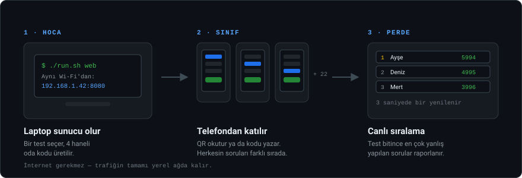
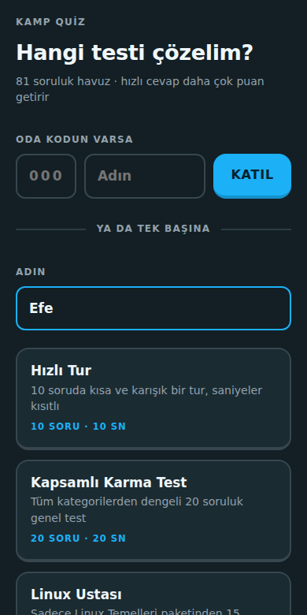
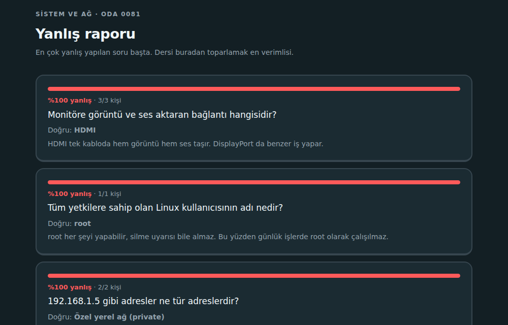

# Kamp Quiz Motoru

### İnternetsiz, hesapsız ve dış kütüphanesiz sınıf bilgi yarışması

Hoca bilgisayarında küçük bir yerel web sunucusu açar. Öğrenciler uygulama indirmeden
telefon tarayıcısından QR kodla katılır; sorular, cevaplar ve sıralama aynı yerel ağda kalır.

> **Kapsam ve durum:** Kamp Quiz, Java 21 ile çalışan, sınıf içi ve aynı yerel ağdaki quiz
> kullanımı için geliştirilmiş bir prototiptir. Hazır soru setleriyle temel akışın genel
> internete açık, yüksek trafikli veya kritik veri gerektiren production kullanımı için
> doğrulaması yapılmamıştır.

> **En önemli ağ kuralı:** Hoca bilgisayarı, telefon ve tablet **aynı Wi-Fi ağına** bağlı olmalı.
> Telefon hotspot'u kullanıyorsan bilgisayarın da o hotspot'a bağlanmalı; yalnızca telefon ve
tabletin aynı hotspot'ta olması bilgisayara erişim sağlamaz.

---

## İndirme ve ilk çalıştırma

### Windows — en kolay yöntem: ZIP indir

Kod yazmayacaksan Git kurmana gerek yok:

1. GitHub sayfasında **Code → Download ZIP** seç.
2. ZIP dosyasını İndirilenler klasöründe çıkar.
3. Çıkardığın `kamp-quiz-main` klasörünü aç.
4. Klasörün boş alanına sağ tıkla ve **Terminalde Aç** seç.
5. Aşağıdaki komutları PowerShell penceresinde çalıştır:

```powershell
# Java 21 yoksa bir kez kur
winget install Microsoft.OpenJDK.21

# Doğru klasörde olduğunu kontrol et
Get-ChildItem

# Önce kurulumun çalıştığını test et
./run.bat test

# Sınıf sunucusunu başlat
./run.bat web
```

Sunucu başladığında ekranda `QR/katılım` adresi ve `/kur` bağlantısı için kullanılacak adresler
görünür. Hoca tarayıcıdan şu sayfayı açar:

```text
http://localhost:8080/kur
```

> `8080` doluysa farklı bir port kullanabilirsin:
>
> ```powershell
> ./run.bat web 8096
> ```
>
> Sunucunun ekranda yazdığı portu ve IP adresini kullan; tahmin etme.

### Windows — Git ile indirme: katkı verecekler için

```powershell
git clone https://github.com/efea0/kamp-quiz.git
Set-Location kamp-quiz
./run.bat test
./run.bat web
```

### macOS / Linux

```bash
git clone https://github.com/efea0/kamp-quiz.git
cd kamp-quiz
chmod +x run.sh
./run.sh test
./run.sh web
```

**Gereken:** Java 21. Hazır soru setleriyle temel quiz akışı yerel ağda internet gerektirmez.
İnternet yalnızca ZIP/Git indirmek ya da isteğe bağlı AI soru üreticisini kullanmak için
gerekir; AI kullanılmadığında oyuncu trafiği dışarı çıkmaz.



---

## QR ile sınıfı bağlama

1. Hoca bilgisayarında `run.bat web` komutunu çalıştırır.
2. Bilgisayarda `/kur` sayfasını açıp test ve akış türünü seçer.
3. Oda açılınca ekrandaki QR’yi projeksiyona verir.
4. Öğrenciler **aynı Wi-Fi/hotspot’a bağlıyken** QR’yi okutur.
5. QR oda kodunu otomatik taşır; öğrencinin tekrar kod yazmasına gerek yoktur. Açılan ekranda yalnızca adını ve istersen tema/karakterini seçip **Oyuna katıl** düğmesine bas.
6. QR çalışmazsa QR’nin altındaki yazılı URL’yi telefonda tarayıcıya elle yazıp dene.

Telefon hotspot’u için doğru sıra:

```text
Telefon hotspot’unu aç
        ↓
Hoca bilgisayarını bu hotspot’a bağla
        ↓
Tableti/telefonları aynı hotspot’a bağla
        ↓
Sunucuyu yeniden başlat ve yeni QR’yi okut
```

QR’nin `localhost`, `127.0.0.1` veya VirtualBox gibi sanal bir IP göstermemesi gerekir.
Windows Güvenlik Duvarı Java için izin sorarsa **Özel ağlar** seçeneğine izin ver.
Okul Wi-Fi’ında cihazlar birbirini göremiyorsa ağda **client isolation** olabilir; telefon
hotspot’u veya sınıf yönlendiricisi kullan.

---

## Ekranlar

| Soru | Cevap ve nedeni | Sonuç |
|:---:|:---:|:---:|
|  |  |  |
| Süre işlerken cevap ver. Hızlı cevap daha çok puan. | Doğru şık yeşil, seçtiğin yanlış şık kırmızı, altında **neden** o cevap. | 6 hazır test ya da kendi ayarların. |

| Projeksiyon | Yanlış raporu |
|:---:|:---:|
|  |  |
| Katılım kodu, QR ve canlı sıralama. | Hangi soru kaç kişiyi düşürdü — en çok yanlıştan başlayarak. |

---

## Ne yapar

| | |
|---|---|
| 🔌 **Yerel ağda çalışır** | Hazır soru setleriyle modem internete bağlı olmasa bile temel quiz çalışır; AI üretimi harici API bağlantısı gerektirir |
| 👤 **Hesap gerekmez** | Adını yaz, katıl. Kayıt, şifre, e-posta yok |
| 📱 **Telefondan katılım** | 4 haneli oda kodu ya da QR. Uygulama indirmek gerekmez |
| ⏱ **Hız puanı** | Doğru cevap 500 puan, kalan süreye göre 500'e kadar bonus |
| 💡 **Açıklamalar** | Yanlış yapınca doğrusunu **ve nedenini** gösterir |
| 🔁 **Tekrar modu** | Sadece yanlışlarından oluşan ikinci bir tur |
| 📊 **Yanlış raporu** | Hocaya: hangi konuyu tekrar anlatmalı |
| 🖥 **İki arayüz** | Terminalde tek kişilik, tarayıcıda sınıfça — aynı motor |
| 🤖 **İsteğe bağlı AI soru üretimi** | Konu yaz, paket üretsin; düzenle, onayla, kaydet. Gerçek sağlayıcıya karşı ayrıca doğrulanmalıdır |
| 🎨 **Kişisel görünüm** | Her oyuncu kendi temasını ve özgün avatarını seçebilir |
| 🎉 **Canlı tepkiler** | Doğru, yanlış ve süre dolumu için kısa sınıf içi animasyonlar |

**81 soru** · 7 kategori · **6 hazır test** · **285 otomatik denetim** · **0 dış bağımlılık**

---

## Sınıfça oynamak — 4 adım

1. **Oda kur** → `/kur` sayfasından bir test seç, 4 haneli kod üretilir
2. **Akışı seç** → `Serbest` modda herkes kendi hızında ilerler; `Senkron` modda herkes aynı soruyu görür ve hoca ilerletir
3. **Perdeye aç** → `/ekran?kod=1234`, sıralama 3 saniyede bir yenilenir
4. **Katıl** → öğrenciler kodu yazar ya da ekrandaki QR'ı okutur; cihazlarından tema ve avatar seçebilir

Serbest modda herkes aynı test paketinden, karıştırılmış kişisel soru sırasıyla ilerler — yan masadan
kopyalamak zorlaşır. Senkron modda ise tüm sınıf aynı soru ve süre üzerinde ilerler.
Tepkiler `/kur` ekranından tamamen kapatılabilir. Test bitince `/rapor?kod=1234` en çok yanlış
yapılan soruları sıralar.

---

## Soru eklemek — katkının en kolay yolu

Java bilmene gerek yok. `questions/` klasörüne bir `.txt` dosyası ekle:

```
# baslik: Tarih

İstanbul hangi yıl fethedildi? | 1453 | 1071 | 1299 | 1923 | 1
> Fatih Sultan Mehmet döneminde, 29 Mayıs 1453'te fethedildi.
```

| Kural | |
|---|---|
| Ayırıcı | dikey çizgi `\|` |
| Son sütun | doğru şıkkın numarası — **1'den** başlar |
| `>` satırı | o sorunun açıklaması (isteğe bağlı ama çok değerli) |
| `#` satırı | yorum. `# baslik:` kategorinin görünen adı |

```bash
git checkout -b soru/tarih-paketi
./run.sh test          # bozmadığından emin ol
git commit -am "Tarih soru paketi eklendi"
git push -u origin soru/tarih-paketi
```

Her pull request'te testler otomatik çalışır. Ayrıntılar: **[CONTRIBUTING.md](CONTRIBUTING.md)**

---

<details>
<summary><b>Kurulum ayrıntıları</b> — Java yoksa, Windows/macOS/Linux</summary>

<br>

Java kurulu mu? `java -version`

| Sistem | Kurulum |
|---|---|
| **Windows** | `winget install Microsoft.OpenJDK.21` ya da [adoptium.net](https://adoptium.net) |
| **macOS** | `brew install openjdk@21` ya da [adoptium.net](https://adoptium.net) |
| **Debian/Ubuntu** | `sudo apt install openjdk-21-jdk` |
| **Fedora** | `sudo dnf install java-21-openjdk-devel` |

Çalıştırma: Windows'ta `run.bat`, macOS/Linux'ta önce bir kez `chmod +x run.sh`, sonra `./run.sh`.

Betik kullanmadan:

```bash
javac -encoding UTF-8 -d out $(find src -name "*.java")
java -Dfile.encoding=UTF-8 -Dstdout.encoding=UTF-8 -cp out quiz.QuizApp
```

Komutlar: `./run.sh` (terminal oyunu) · `./run.sh web [port]` (sunucu) · `./run.sh test` (denetimler)
</details>

<details>
<summary><b>Telefonlar bağlanamıyorsa</b> — güvenlik duvarı, IP bulma, ağ yalıtımı</summary>

<br>

| Belirti | Çözüm |
|---|---|
| Windows'ta uyarı penceresi çıktı | Güvenlik duvarı — **"Özel ağlarda izin ver"** işaretle |
| macOS'ta bağlantı yok | Sistem Ayarları → Ağ → Güvenlik Duvarı → gelen bağlantılara izin |
| Linux'ta bağlantı yok | `sudo ufw allow 8080/tcp` |
| Hiçbiri olmuyor | Ağ **client isolation** kullanıyor olabilir (okul Wi-Fi'larında yaygın). Telefonun hotspot'unu aç, laptopu ona bağla |
| `Address already in use` | Port meşgul: `./run.sh web 9000` |

IP adresini bulmak: `ipconfig` (Windows) · `ipconfig getifaddr en0` (macOS) · `hostname -I` (Linux)
</details>

<details>
<summary><b>AI ile soru üretme</b> — kurulum ve anahtar güvenliği</summary>

<br>

`/uret` sayfasından konu yazıp paket ürettirebilirsin. Üretilen taslak **doğrudan quize girmez**:
düzenlenebilir hâlde gelir, elle ya da "AI ile düzenle" kutusuyla değiştirilir, kaydetmeden önce
biçimi doğrulanır.

> **Doğrulama notu:** AI üretim akışı yerel olarak yapılandırma ve form davranışı seviyesinde
> denetlenmiştir. Gerçek Gemini/OpenRouter hesabına karşı uçtan uca doğrulama yapılmadığı için
> yarınki quiz akışının kritik bir parçası olarak kullanılmamalıdır.

**API anahtarı koda yazılmaz.** En güvenli yol, anahtarı sadece kendine okunur bir dosyaya koymak:

```bash
mkdir -p ~/.config/kamp-quiz
printf '%s' "ANAHTARIN" > ~/.config/kamp-quiz/gemini.key
chmod 600 ~/.config/kamp-quiz/gemini.key
```

OpenRouter için dosya adı `openrouter.key`. **İkisi de varsa önce Gemini denenir; kota dolduğunda
OpenRouter'a otomatik geçilir.** Ortam değişkeni de çalışır (`GEMINI_API_KEY`) ama `export` satırı
kabuk geçmişine düşer, bu yüzden dosya daha güvenlidir.

```bash
export QUIZ_ADMIN_KEY="birparola"    # /uret sayfasını kilitler, önerilir
export OPENROUTER_MODEL="saglayici/model"
```

Anahtar tanımlı değilse uygulama normal çalışır, yalnızca `/uret` kapalı görünür.
Depoda anahtar bulunmaz — projeye katkı veren kimse göremez.
</details>

<details>
<summary><b>Mimari</b> — dosyalar ve değişmez kural</summary>

<br>


```
src/quiz/
├── QuizApp.java            giriş noktası, parçaları bağlar
├── model/Question.java     soru verisi, kendi geçerliliğini korur
├── core/                   iş mantığı — ekranı hiç bilmez
│   ├── QuestionBank.java   questions/*.txt okur, bozuk satırı atlar
│   ├── Quiz.java           sıra, süre, puan, cevap geçmişi
│   ├── QuizSet.java        hazır test tanımı
│   └── Scoreboard.java     scores.txt'ye yazar, sıralar
├── cli/ConsoleUI.java      terminal arayüzü
├── web/                    tarayıcı arayüzü
│   ├── WebServer.java      JDK'nın HttpServer'ı ve rota tablosu
│   ├── ServerContext.java  ortak oturum, oda ve HTTP yardımcıları
│   ├── HomePages.java      ana sayfa, ayarlar ve katılım akışı
│   ├── QuizPages.java      soru, cevap ve sonuç akışı
│   ├── RoomPages.java      oda paneli, perde ve yanlış raporu
│   ├── BoardPage.java      lider tablosu
│   ├── GeneratePages.java  AI soru paketi akışı
│   ├── GameSession.java    oyuncu oturumu, tema ve avatar
│   ├── Reactions.java      sınıf içi tepki metinleri
│   ├── QrCode.java         sıfırdan QR kodlayıcı
│   └── Html.java           sayfa şablonu ve merkezi stil
├── ai/QuestionGenerator.java   Gemini / OpenRouter ile soru üretimi
└── test/SelfTest.java      birim ve kaynak sözleşmeleri
    └── WebSmokeTest.java   JDK HTTP istemcisiyle 32 web kontrolü
```

**Değişmez kural:** `core/` ve `model/` paketlerinde tek bir `System.out.println` yoktur —
ekranı hiç tanımazlar. Bozuk bir soru satırı bulunduğunda uyarı ekrana basılmaz, çağıran arayüze
**liste olarak döndürülür**; onu nasıl göstereceğine terminal ya da web arayüzü karar verir.

Kural yazıyla kalmıyor: `./run.sh test` kaynak kodu okuyup bu paketlerde `System.out` arıyor.
Kuralı bozan bir katkı testte kırmızı görünür.

Karşılığını web arayüzünü eklerken aldık: terminal ve tarayıcı **aynı motoru** paylaşıyor,
`Quiz` ve `Scoreboard` sınıflarına tek satır dokunulmadı.
</details>

<details>
<summary><b>Davranış notları</b> — kenar durumlarda ne olur</summary>

<br>

- Bozuk bir soru satırı quizi çökertmez; atlanır ve uyarı basılır
- Sayı yerine harf girilirse program çökmez, soruyu tekrar sorar
- Sayfayı yenilemek geri sayımı sıfırlamaz — süre soru başına bir kez başlar
- Süre dolduğunda cevap sunucu tarafında yanlış sayılır; tarayıcıyı kandırmak işe yaramaz
- Cevap gönderimi POST-Redirect-GET kullanır: yenilemek cevabı tekrar göndermez
- Tekrar turu oda sıralamasını etkilemez
- Tüm dosya okuma/yazma UTF-8'e sabitlenmiştir
- 25 sentetik istemciyle eşzamanlı HTTP akışı denendi; bu sonuç gerçek kullanıcı deneyimi veya sınıf ağı garantisi değildir
</details>

---

## Yol haritası

| | |
|---|---|
| ✔ | Katmanlı mimari, dosyadan soru okuma, skor ve lider tablosu |
| ✔ | Web arayüzü, oda kodu, projeksiyon ekranı, QR ile katılım |
| ✔ | Süre sınırı, hız puanı, açıklamalar, tekrar modu, yanlış raporu |
| ✔ | Hazır test setleri, AI ile soru üretme, kendi kendini test |
| ✔ | Senkron canlı mod — herkes aynı soruda, hoca ilerletir |
| ✔ | Kişisel tema, özgün avatarlar ve öğretmen kontrollü sınıf tepkileri |
| ☐ | Takım modu |

## Katkı

Soru paketi, yeni özellik, hata düzeltmesi — hepsi açık.
Başlamadan önce **[CONTRIBUTING.md](CONTRIBUTING.md)** dosyasına bak.
